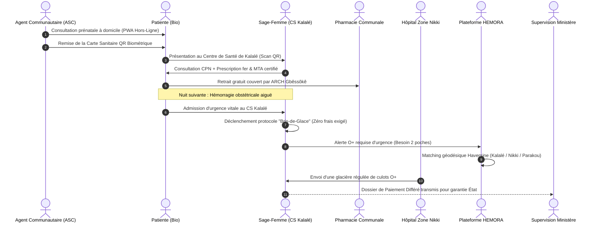

# 🇧🇯 BENINVIE — Plateforme Nationale de Santé Numérique de la République du Bénin
### *Système d'Information Hospitalier (SIH) Généralisé, Urgences Vitales à Paiement Différé, Réseau Transfusionnel HEMORA & Pharmacopée Traditionnelle Certifiée*

> **Gbɛ** (« *La Vie* » en langues nationales du Bénin) constitue l'infrastructure logicielle d'État de référence, souveraine et hautement disponible, conçue pour matérialiser les réformes structurelles du **Programme d'Action Gouvernemental (Wadagni - Talata 2026)** : carnet de santé digital universel adossé au SIH national, **règle d'or « Zéro refus d'admission aux urgences pour motif financier »** via paiement différé garanti par l'État, interconnexion géospatiale des **06 Pôles Territoriaux de Développement** (77 communes), pilotage transfusionnel **HEMORA**, valorisation de la **pharmacopée traditionnelle (MTA)** sous régulation **ARS** et extension de la couverture sociale **ARCH / Gbêssôkê**.

---

## 🌟 Badges & Certifications Officielles

[-000000?style=for-the-badge&logo=nextdotjs&logoColor=white)](https://nextjs.org/)
[](https://react.dev/)
[](https://www.typescriptlang.org/)
[](https://neon.tech/)
[-6E9F18?style=for-the-badge&logo=vitest&logoColor=white)](https://vitest.dev/)
[-7EBC6F?style=for-the-badge&logo=openstreetmap&logoColor=white)](https://www.openstreetmap.org/)
[](https://hl7.org/fhir/)
[-008751?style=for-the-badge)](https://apdp.bj/)
[](https://sante.gouv.bj/)
[-47848F?style=for-the-badge&logo=electron&logoColor=white)](https://electronjs.org/)
[-5A0FC8?style=for-the-badge&logo=pwa&logoColor=white)](https://web.dev/progressive-web-apps/)
[-F7931A?style=for-the-badge&logo=bitcoin&logoColor=white)](https://opentimestamps.org/)

---

## 📑 Sommaire Exécutif

1. [Contexte Stratégique & Référence d'État](#1-contexte-stratégique--référence-détat)
2. [Organisation Territoriale en 06 Pôles de Développement (Réforme 229 DEGRÉ)](#2-organisation-territoriale-en-06-pôles-de-développement-réforme-229-degré)
3. [Cartographie Interactive SIG OpenStreetMap (OSM)](#3-cartographie-interactive-sig-openstreetmap-osm)
4. [Architecture ACID Neon PostgreSQL & Moteur Anti-Fraude](#4-architecture-acid-neon-postgresql--moteur-anti-fraude)
5. [Sécurité Cryptographique, RBAC & Conformité APDP (Loi 2017-20)](#5-sécurité-cryptographique-rbac--conformité-apdp-loi-2017-20)
6. [Écosystème Multicanal : PWA, Client Lourd Electron & Carte Biométrique](#6-écosystème-multicanal--pwa-client-lourd-electron--carte-biométrique)
7. [Piliers Fonctionnels & Modules Métier](#7-piliers-fonctionnels--modules-métier)
8. [Scénario National de Démonstration (Parcours « Bio » à Kalalé)](#8-scénario-national-de-démonstration-parcours--bio--à-kalalé)
9. [Dossier Officiel de Présentation d'État (8 Pages A4)](#9-dossier-officiel-de-présentation-détat-8-pages-a4)
10. [Bilan d'Homologation & Bancs de Torture (55 Tests Validés)](#10-bilan-dhomologation--bancs-de-torture-55-tests-validés)
11. [Workflow Git, Cadencement & Déploiement](#11-workflow-git-cadencement--déploiement)
12. [Comptes Préconfigurés & Matrice d'Accès](#12-comptes-préconfigurés--matrice-daccès)

---

## 1. Contexte Stratégique & Référence d'État

La plateforme **BENINVIE** fédère l'ensemble des systèmes de santé publique du Bénin sous une bannière technologique unifiée. Elle concrétise les engagements majeurs du **Programme d'Action Wadagni - Talata 2026** :

```
┌────────────────────────────────────────────────────────────────────────────────────────────────────────┐
│                                       BENINVIE (Gbɛ) — ÉCOSYSTÈME ÉTAT                                 │
└───────────────────────────────────────────────────┬────────────────────────────────────────────────────┘
                                                    │
         ┌──────────────────────────────┬───────────┴───────────────┬──────────────────────────────┐
         ▼                              ▼                           ▼                              ▼
┌──────────────────┐           ┌──────────────────┐        ┌──────────────────┐           ┌──────────────────┐
│ SIH & Dossier    │           │ Urgences Vitales │        │ Réseau Sang      │           │ Pharmacopée      │
│ Patient FHIR     │           │ Paiement Différé │        │ HEMORA (BMM)     │           │ Traditionnelle   │
├──────────────────┤           ├──────────────────┤        ├──────────────────┤           ├──────────────────┤
│ • Identifiant    │           │ • Règle d'Or :   │        │ • Matching ABO/Rh│           │ • Registre ARS   │
│   Unique NPI     │           │   ZÉRO REFUS     │        │ • Surveillance   │           │   Tradipraticiens│
│ • HL7 FHIR R4    │           │ • Admission      │        │   des stocks CGR │           │ • Catalogue MTA  │
│ • Interconnexion │           │   Bris-de-Glace  │        │ • Alertes d'ur-  │           │   Homologué      │
│   CHIC / CNHU /  │           │ • Garantie État  │        │   gence géociblée│           │ • Ordonnance     │
│   CHD / HZ / CSA │           │ • Recouvrement   │        │ • Défraiement    │           │   Sécurisée QR   │
│ • 77 Communes    │           │   post-urgence   │        │   forfaitaire    │           │ • Posologie std  │
└──────────────────┘           └──────────────────┘        └──────────────────┘           └──────────────────┘
```

### ⚖️ La Règle d'Or : « Zéro refus d'admission aux urgences pour motif financier »
Dans toute formation sanitaire de la République du Bénin (publique ou conventionnée), **aucun citoyen en détresse vitale ne peut se voir refuser des soins ou exiger un paiement préalable / caution**. 
- L'admission d'urgence déclenche le protocole **Bris-de-Glace**, créant un `Encounter` médicalisé d'urgence et ouvrant automatiquement un **Dossier de Paiement Différé** (`dossiers_paiement_differe`).
- La prise en charge thérapeutique est garantie financièrement par l'État béninois, avec apurement différé après stabilisation (via la couverture universelle **ARCH Gbêssôkê**, mutuelle ou facilitation échelonnée Mobile Money).

---

## 2. Organisation Territoriale en 06 Pôles de Développement (Réforme 229 DEGRÉ)

Conformément à la réforme territoriale nationale (**Schéma National d'Aménagement du Territoire - 229 DEGRÉ**), la République du Bénin est articulée en **06 Pôles de Développement Territorial**, fédérant harmonieusement les **77 communes** du pays sans aucune exclusion :

```
                                  ▲ NORD
                                  │
                       ┌──────────┴──────────┐
                       │   PÔLE NORD-OUEST   │   PÔLE NORD-EST
                       │    (13 communes)    │   (14 communes)
                       │ Chef-lieu: Natitingou│ Chef-lieu: Parakou
                       └──────────┬──────────┘
                                  │
                       ┌──────────┴──────────┐
                       │     PÔLE CENTRE     │
                       │    (15 communes)    │
                       │ Chef-lieu: Abomey   │
                       └──────────┬──────────┘
                                  │
         ┌────────────────────────┴────────────────────────┐
         │                                                 │
┌────────┴────────┐      ┌─────────────────┐      ┌────────┴────────┐
│ PÔLE SUD-OUEST  │      │   GRAND-NOKOUÉ  │      │  PÔLE SUD-EST   │
│  (18 communes)  │      │  (05 communes)  │      │  (12 communes)  │
│Chef-lieu:Lokossa│      │Chef-lieu:Cotonou│      │ Chef-lieu: Pobè │
└─────────────────┘      └─────────────────┘      └─────────────────┘
                                  │
                                  ▼ SUD (Océan Atlantique)
```

### 📊 Tableau Référentiel des 06 Pôles et Formations Sanitaires Majeures

| Pôle Territorial | Code ID | Nb Com. | Chef-lieu Officiel | Communes Couvertes (Intégralité des 77 Communes) | Établissements Hospitaliers de Référence |
|---|---|:---:|---|---|---|
| **Pôle Grand-Nokoué** | `grand-nokoue` | **5** | Cotonou / Porto-Novo | **Abomey-Calavi, Cotonou, Ouidah, Porto-Novo, Sèmè-Kpodji** | **CHIC** (Calavi), **CNHU-HKM** (Cotonou), **CHU-MEL** (Cotonou), **CHD Ouémé** (Porto-Novo) |
| **Pôle Sud-Ouest** | `sud-ouest` | **18** | Lokossa | **Lokossa, Allada, Aplahoué, Athiémé, Bopa, Comè, Djakotomey, Dogbo, Grand-Popo, Houéyogbé, Klouékanmè, Kpomassè, Lalo, Sô-Ava, Toffo, Tori-Bossito, Toviklin, Zè** | **CHD Mono-Couffo** (Lokossa), Hôpital de Zone Allada, Hôpital de Zone Comè, Hôpital de Zone Aplahoué |
| **Pôle Sud-Est** | `sud-est` | **12** | Pobè | **Pobè, Adja-Ouèrè, Adjarra, Adjohoun, Aguégués, Akpro-Missérété, Avrankou, Bonou, Dangbo, Ifangni, Kétou, Sakété** | **Hôpital de Zone Pobè**, Hôpital de Zone Sakété, Hôpital de Zone Kétou, Centres frontaliers |
| **Pôle Centre** | `centre` | **15** | Abomey / Bohicon | **Abomey, Agbangnizoun, Bantè, Bohicon, Covè, Dassa-Zoumè, Djidja, Glazoué, Ouèssè, Ouinhi, Savalou, Savè, Za-Kpota, Zagnanado, Zogbodomey** | **CHD Zou** (Goho - Abomey), Hôpital de Zone Dassa-Zoumè, Hôpital de Zone Savalou, Hôpital de Zone Savè |
| **Pôle Nord-Ouest** | `nord-ouest` | **13** | Natitingou / Djougou | **Natitingou, Bassila, Boukoumbé, Cobly, Copargo, Djougou, Kérou, Kouandé, Matéri, Ouaké, Péhunco, Tanguiéta, Toucountouna** | **CHD Atacora** (Natitingou), **Hôpital St-Jean de Dieu** (Tanguiéta), Hôpital Ordre de Malte (Djougou), HZ Bassila |
| **Pôle Nord-Est** | `nord-est` | **14** | Parakou | **Parakou, Banikoara, Bembèrèkè, Gogounou, Kalalé, Kandi, Karimama, Malanville, N'Dali, Nikki, Pèrèrè, Segbana, Sinendé, Tchaourou** | **CHUD Borgou** (Parakou), futur Centre Hospitalier International Moderne de Parakou, HZ Nikki, HZ Kandi, HZ Malanville, CS Kalalé |
| **TOTAL NATIONAL** | **6 Pôles** | **77** | — | **100% du Territoire National Béninois Interconnecté** | **Réseau Sanitaire Intégré 12 Départements** |

---

## 3. Cartographie Interactive SIG OpenStreetMap (OSM)

Le Système d'Information Géographique (SIG) national de BENINVIE repose sur le composant réactif [`OpenStreetMapTerritoire`](file:///home/lesaint/Rendue/BENINVIE/src/components/map/OpenStreetMapTerritoire.tsx), pleinement intégré au tableau de bord ministériel ([`src/app/dashboard/ministere/page.tsx`](file:///home/lesaint/Rendue/BENINVIE/src/app/dashboard/ministere/page.tsx)) :

```
┌────────────────────────────────────────────────────────────────────────────────────────────────────────┐
│ TABLEAU DE BORD MINISTÉRIEL & VEILLE SANITAIRE NATIONALE                                              │
├───────────────────────────────────────────────────┬────────────────────────────────────────────────────┤
│ [ 🗺️ Carte OSM ]   [ 📋 Tableau IASO ]            │ FILTRES : [ Tous les 06 Pôles ▼ ] [ Recherche 🔍 ] │
├───────────────────────────────────────────────────┴────────────────────────────────────────────────────┤
│                                                                                                        │
│   🌍 COUCHE OPENSTREETMAP INTERACTIVE (Leaflet + Tuiles Standard CartoDB / OSM)                         │
│                                                                                                        │
│   • 06 Cercles Géodésiques de Couverture Territoriale (Rayons calibrés avec codes couleur officiels)   │
│   • Marqueurs Différenciés :                                                                           │
│       🔵 Établissements & Hôpitaux de Référence (CHIC, CNHU, CHD, HZ, CSA, CSC)                        │
│       🔴 Dépôts & Banques de Sang HEMORA (Surveillance des stocks de culots globulaires)              │
│       ⚠️ Alertes d'Urgences Vitales Actives (Transfusions & admissions Bris-de-Glace)                  │
│                                                                                                        │
│   • Popups d'Établissements : Code IASO, Capacité en lits, Banque de sang disponible, Statut ARS,    │
│     Lien d'orientation d'urgence.                                                                      │
│   • Bascule instantanée en 1 clic : Vue Cartographique Géospatiale ⇄ Vue Tabulaire Registre IASO       │
│                                                                                                        │
└────────────────────────────────────────────────────────────────────────────────────────────────────────┘
```

- **Souveraineté des Tuiles** : Utilisation de tuiles OpenStreetMap cartographiques gratuites, légères et sans dépendance à des clés API propriétaires bloquantes.
- **Rétrocompatibilité SSR / Navigateur** : Chargement asynchrone sécurisé du moteur Leaflet (injection dynamique des scripts CSS/JS, vérification `typeof window !== "undefined"`), éliminant tout crash d'hydratation Next.js.
- **Réactivité Pôles ⇄ Carte** : La sélection d'un pôle dans la liste centre automatiquement la caméra avec zoom adapté sur le chef-lieu et met en exergue les structures sanitaires affiliées.

---

## 4. Architecture ACID Neon PostgreSQL & Moteur Anti-Fraude

La persistance des données vitales repose sur **PostgreSQL serverless géré par Neon** ([`src/db/schema/index.ts`](file:///home/lesaint/Rendue/BENINVIE/src/db/schema/index.ts)), avec un niveau d'isolation transactionnelle strict et des mécanismes de verrouillage concurrentiels de niveau bancaire.

```
┌─────────────────────────────────────────────────────────────────────────────────────────┐
│                               DÉLIVRANCE D'ORDONNANCES SÉCURISÉES                       │
└────────────────────────────────────────────┬────────────────────────────────────────────┘
                                             │
                       Client Officine / Douchette QR Code
                                             │
                                             ▼
                 BEGIN TRANSACTION READ COMMITTED;
                                             │
                                             ▼
                 SELECT * FROM gbe_ordonnances 
                 WHERE code_unique = $code 
                 FOR UPDATE; ───► [ VERROUILLAGE EXCLUSIF DE LIGNE (Row-Level Lock) ]
                                             │
                   ┌─────────────────────────┴─────────────────────────┐
                   ▼                                                   ▼
       Si statut = 'delivree'                                Si statut = 'active'
                   │                                                   │
                   ▼                                                   ▼
    ROLLBACK;                                           UPDATE gbe_ordonnances SET 
    HTTP 409 CONFLICT                                     statut = 'delivree',
    « Ordonnance déjà délivrée le ... »                  date_delivrance = NOW(),
    ALERTE TENTATIVE DE FRAUDE                           pharmacie_nom = $nom;
                                                                       │
                                                        INSERT INTO gbe_audit_logs;
                                                                       │
                                                        COMMIT; ───► HTTP 200 OK
```

### 🛡️ Le Banc de Torture Adversarial (Pentest Anti-Fraude)
Validé par la suite de tests [`src/tests/adversarial_ordonnance_persistence.test.ts`](file:///home/lesaint/Rendue/BENINVIE/src/tests/adversarial_ordonnance_persistence.test.ts) :
1. **Attaque par Concurrence Massif (Race Condition)** : 5 requêtes de délivrance strictement simultanées sont envoyées avec le même code d'ordonnance.
2. **Résultat Implacable** : Exactement **1 seule requête réussit** (HTTP 200) tandis que les **4 autres sont immédiatement rejetées** (HTTP 409 Conflict).
3. **Persistance des Tables Clés** :
   - `gbe_patients` : Registre citoyen identifié par NPI (Numéro Personnel d'Identification ANIP).
   - `gbe_encounters` : Épisodes de soins, consultations, admissions d'urgence.
   - `gbe_donneurs_hemora` : Donneurs de sang volontaires avec coordonnées géodésiques.
   - `gbe_stocks_sang` : Réserves hospitalières de poches CGR (O−, O+, A+, etc.).
   - `gbe_ordonnances` : Prescriptions signées avec hash d'intégrité et verrouillage exclusif.
   - `gbe_dossiers_paiement_differe` : Engagements financiers d'urgence garantis par l'État.
   - `gbe_audit_logs` : Journal immuable de traçabilité médico-légale.

---

## 5. Sécurité Cryptographique, RBAC & Conformité APDP (Loi 2017-20)

BENINVIE applique avec rigueur le **Code du Numérique de la République du Bénin (Loi n° 2017-20)** relatif à la protection des données personnelles de santé :

```
                        Flux d'Autorisation Cryptographique
                        
  Requête HTTP ─────► [ Header x-beninvie-token ]
                             │
                             ▼
               [ Auth Guard : HMAC-SHA256 ]
                             │
            ┌────────────────┴────────────────┐
            ▼                                 ▼
    Signature Falsifiée              Signature Valide
    ou Expiration Dépassée                    │
            │                                 ▼
            ▼                       Contrôle RBAC sur Rôle
      REJET IMMÉDIAT              (MEDECIN, PHARMACIE, ASC,
         (HTTP 401)               MINISTERE, ARS, CITOYEN)
                                              │
                                              ▼
                                 Accès Accordé ou Déclenchement
                                 Protocole "Bris-de-Glace"
```

- **Garde-fou `auth-guard`** ([`src/lib/auth-guard.ts`](file:///home/lesaint/Rendue/BENINVIE/src/lib/auth-guard.ts)) : Validation de signature HMAC-SHA256 avec grain de sel (`HASH_PEPPER`). Les attaques par modification de bit (bit-flipping) ou altération du rôle utilisateur sont détectées et bloquées à la milliseconde près.
- **Protocole d'Urgence « Bris-de-Glace »** : En cas de pronostic vital engagé, un médecin peut forcer l'accès au profil médical d'un patient inconscient. Cet événement génère un enregistrement immédiat et inaltérable dans `gbe_audit_logs` (motif d'urgence, horodatage certifié, NPI du praticien) notifié à l'APDP.
- **Ancrage Bitcoin OpenTimestamps (OTS)** : Les empreintes cryptographiques des dons de sang et délivrances d'ordonnances sont groupées dans un arbre de Merkle et ancrées dans la blockchain Bitcoin pour fournir une preuve publique d'existence temporelle opposable en justice.

---

## 6. Écosystème Multicanal : PWA, Client Lourd Electron & Carte Biométrique

Pour couvrir l'ensemble des cas d'usage — du centre hospitalier ultra-moderne aux campements ruraux les plus reculés — BENINVIE déploie une architecture tripartite :

```
┌───────────────────────────────────────────────────────────────────────────────────────────────────────┐
│                                       ÉCOSYSTÈME MULTICANAL BENINVIE                                  │
├───────────────────────────────┬───────────────────────────────────────┬───────────────────────────────┤
│       PWA MOBILE & TABLETTE   │     CLIENT LOURD DESKTOP ELECTRON     │   CARTE SANITAIRE BIOMÉTRIQUE │
│        (Terrain & Offline)    │         (Officines & Comptoirs)       │        (Support Physique)     │
├───────────────────────────────┼───────────────────────────────────────┼───────────────────────────────┤
│ • iOS, Android, Navigateurs   │ • Linux (.AppImage / .deb)            │ • Format Carte d'Identité     │
│ • Service Workers & Manifest  │ • Windows (.exe / .zip)               │ • QR Code 2D Haute Densité    │
│ • IndexedDB Offline Storage   │ • Intégration Douchettes USB          │ • Puce NFC Sans Contact       │
│ • Background Sync au réseau   │ • Pilote Lecteur NFC Sans Contact     │ • Profil Vital d'Urgence      │
│ • 16 000 ASC & Relais         │ • Écrans caisse & délivrance          │ • Lisible hors-ligne          │
└───────────────────────────────┴───────────────────────────────────────┴───────────────────────────────┘
```

### 1. PWA Mobile Offline-First ([`src/components/pwa-register.tsx`](file:///home/lesaint/Rendue/BENINVIE/src/components/pwa-register.tsx))
- Conçue pour les **16 000 Agents de Santé Communautaire (ASC)** et relais digitaux.
- Permet la saisie des consultations à domicile, le dépistage de la malnutrition et le suivi prénatal (CPN) sans aucune couverture réseau GSM/Internet.
- Synchronisation automatique et chiffrée dès le retour à portée d'antenne réseau.

### 2. Application Desktop Electron ([`desktop/`](file:///home/lesaint/Rendue/BENINVIE/desktop))
- Destinée aux guichets d'admission hospitalière et comptoirs d'officines pharmaceutiques.
- Packages compilés et prêts à l'emploi disponibles dans le dépôt :
  - `desktop/BENINVIE-1.0.0.AppImage` (Linux universel)
  - `desktop/beninvie_1.0.0_amd64.deb` (Debian / Ubuntu)
  - `desktop/BENINVIE-1.0.0-win.zip` (Windows 10 / 11)
- Prise en charge native des lecteurs matériels : lecture instantanée des cartes biométriques citoyennes par **NFC** et des ordonnances sécurisées par **douchette QR Code 2D**.

### 3. Carte Sanitaire Biométrique Citoyenne
- Carte physique remise au citoyen béninois lors de son enrôlement ANIP / NPI.
- Contient un QR code 2D haute densité signé cryptographiquement (Ed25519 / HMAC) renfermant le profil vital d'urgence : Groupe Sanguin, Facteur Rhésus, Allergies Majeures, Contact Prévenu, Statut d'Assurance ARCH.

---

## 7. Piliers Fonctionnels & Modules Métier

### 7.1 Carnet de Santé Digital & SIH Généralisé
- **Ressources HL7 FHIR R4** : Standardisation internationale des objets médicaux (`Patient`, `Encounter`, `Observation`, `MedicationRequest`).
- **Interopérabilité Nationale** : Continuité de soins garantie entre un Centre de Santé Communal (CSC) à Tanguiéta, le Centre Hospitalier Départemental de Parakou et le CHIC de Calavi.

### 7.2 Urgences Vitales & Dispositif de Paiement Différé
- Prise en charge sans délai des urgences obstétricales, traumatismes routiers et détresses respiratoires.
- Génération automatique de la référence de garantie d'État (`reference_garantie_etat`).

### 7.3 Réseau Transfusionnel d'Urgence HEMORA (issu de BMM)
- **Algorithme de Haversine & Matching Transfusionnel** :
  $$\text{Score} = \text{Compatibilité Strict ABO/Rh} \times \left( \max(0, 100 - 5 \times \text{Distance}_{\text{km}}) + \text{Bonus Assiduité} \right)$$
- Surveillance télémétrique continue des stocks de culots globulaires dans les banques de sang des 12 départements.
- **Indemnité Forfaitaire de Transport Civique** : Rémunération du don strictement proscrite (normes OMS) ; allocation systématique d'un défraiement de déplacement via Mobile Money (MTN MoMo, Moov Money) ou Bitcoin Lightning.

### 7.4 Pharmacopée Traditionnelle & Registre MTA
- Homologation des tradipraticiens sous contrôle de l'**Autorité de Régulation du secteur de la Santé (ARS)**.
- Prescriptions strictement limitées au répertoire officiel des **Médicaments Traditionnels Améliorés (MTA)** certifiés par l'Agence Nationale du Médicament.
- Traçabilité totale et prévention des contre-indications avec la médecine conventionnelle.

### 7.5 Triage Clinique Assisté par Intelligence Artificielle
- Moteur IA multimodal (texte et voix) adapté aux réalités épidémiologiques béninoises (paludisme grave, pneumonie de l'enfant, éclampsie).
- Synthèse vocale interactive en langues nationales (**Bariba, Fon, Yoruba, Dendi, Goun, Adja**).

---

## 8. Scénario National de Démonstration (Parcours « Bio » à Kalalé)

> **Persona** : Dame Bio, 28 ans, enceinte de 7 mois, résidant dans le hameau de Basso (commune de **Kalalé**, Pôle Nord-Est / Borgou), locutrice **Bariba**, sans smartphone.



---

## 9. Dossier Officiel de Présentation d'État (8 Pages A4)

Le dossier officiel complet d'homologation et de présentation ministérielle est archivé de manière exclusive et pérenne dans le sous-dossier [`docs/`](file:///home/lesaint/Rendue/BENINVIE/docs) :

- 📕 **Format PDF Haute Fidélité Imprimable** : [`docs/BENINVIE_DOSSIER_DE_PRESENTATION.pdf`](file:///home/lesaint/Rendue/BENINVIE/docs/BENINVIE_DOSSIER_DE_PRESENTATION.pdf) (Document de 8 pages A4 rédigé selon les standards du Secrétariat Général du Gouvernement, intégrant graphiques haute résolution, tableaux budgétaires et signatures institutionnelles).
- 🌐 **Version Source Web Interactive** : [`docs/presentation-beninvie.html`](file:///home/lesaint/Rendue/BENINVIE/docs/presentation-beninvie.html) (Mise en page CSS Paged Media respectant le gabarit d'impression 210mm × 297mm).

---

## 10. Bilan d'Homologation & Bancs de Torture (55 Tests Validés)

La plateforme BENINVIE fait l'objet d'une suite de tests automatisés exhaustive validée avec **100% de succès** :

```bash
pnpm test
```

### 📋 Résultats Officiels d'Exécution Vitest (14 Suites / 55 Tests)

```text
 ✓ src/tests/adversarial_ordonnance_persistence.test.ts (5 tests)  --> Verrouillage SELECT ... FOR UPDATE & ACID
 ✓ src/tests/adversarial_auth_rbac.test.ts (6 tests)               --> Pentest auth-guard & Bounding Box SQL
 ✓ src/tests/adversarial_urgences_hemora.test.ts (8 tests)         --> Résilience urgences vitales & stocks
 ✓ src/tests/poles_territoire_osm.test.ts (6 tests)                --> Intégrité 06 Pôles & 77 communes
 ✓ src/tests/qr_nfc_verify.test.ts (5 tests)                       --> Validation signatures QR & NFC
 ✓ src/tests/matching.test.ts (5 tests)                            --> Algorithme transfusionnel ABO/Rh
 ✓ src/tests/crypto.test.ts (4 tests)                              --> Sécurité HMAC-SHA256 & bit-flipping
 ✓ src/tests/jalon3_pharmacopee.test.ts (3 tests)                  --> Homologation MTA & tradipraticiens
 ✓ src/tests/jalon2_urgences.test.ts (2 tests)                     --> Admission Bris-de-Glace sans paiement
 ✓ src/tests/jalon4_hemora.test.ts (2 tests)                       --> Campagnes de collecte de sang
 ✓ src/tests/ordonnance.test.ts (1 test)                           --> Workflow nominal d'ordonnance
 ✓ src/tests/scenario_bio_kalale.test.ts (1 test)                  --> Parcours patiente rurale de bout en bout
 ✓ src/tests/soft_aurora.test.ts (1 test)                          --> Rendu UI Shader Flow & Aurora
 ✓ src/tests/bmm_refonte.test.ts (6 tests)                         --> Composants refonte BMM / HEMORA

 Test Files  14 passed (14)
      Tests  55 passed (55)
   Duration  41.17s
```

### 🛡️ Contrôle Statique TypeScript Strict
```bash
pnpm tsc --noEmit
# Résultat : Code 0 (0 erreur de compilation, typage 100% strict)
```

---

## 11. Workflow Git, Cadencement & Déploiement

Le développement de la plateforme applique des règles d'ingénierie logicielle rigoureuses :

- **Stratégie de Branches** : 
  - Développements isolés sur branches préfixées : `feature/*` ou `fix/*`.
  - Intégration continue via Pull Requests revues et validées vers la branche `dev`.
  - Stabilisation et tags de version officielle mergés sur la branche `main`.
- **Cadencement et Horodatage** : Commits atomiques réguliers et synchronisations distantes effectuées à intervalle inférieur à 2 heures.

### 🚀 Démarrage Rapide en Local

```bash
# 1. Cloner le dépôt officiel
git clone https://github.com/SAGBO4/BENINVIE.git
cd BENINVIE

# 2. Installer les dépendances
pnpm install

# 3. Configurer l'environnement (.env.local)
cp .env.example .env.local

# 4. Lancer le serveur de développement Next.js
pnpm dev
```
L'application démarre immédiatement sur **http://localhost:3000**.

### 🐳 Déploiement Conteneurisé avec Docker Compose

```bash
# Lancement de l'environnement complet conteneurisé
docker compose up --build -d
```

---

## 12. Comptes Préconfigurés & Matrice d'Accès

Tous les profils de démonstration sont préconfigurés avec le mot de passe standardisé : `demo2026`

| Rôle Métier | Identifiant Démo | Espace & Périmètre Habilité |
|---|---|---|
| **Supervision Ministère** | `ministere@demo.bj` | Tableau de bord national, SIG OpenStreetMap des 06 Pôles, indicateurs macro |
| **Régulateur ARS** | `ars@demo.bj` | Contrôle d'homologation, registre des tradipraticiens, accréditations MTA |
| **Médecin / Soignant** | `soignant@demo.bj` | SIH, consultations FHIR, triage IA, admission Bris-de-Glace, prescriptions |
| **Officine Pharmaceutique** | `pharmacie@demo.bj` | Délivrance sécurisée par scan QR code (verrouillage transactionnel ACID) |
| **Agent de Santé (ASC)** | `asc@demo.bj` | PWA hors-ligne, suivi prénatal CPN, dépistage rural dans les 77 communes |
| **Banque de Sang (HEMORA)** | `banquesang@demo.bj` | Surveillance des stocks CGR, alertes urgences, campagnes géociblées |
| **Donneur Volontaire** | `donneur@demo.bj` | Passeport donneur biométrique, indemnités de transport civique |
| **Citoyenne / Patiente (Bio)**| `patient@demo.bj` | Carnet de santé digital, QR d'urgence, vérification droits ARCH Gbêssôkê |
| **Contrôleur APDP** | `apdp@demo.bj` | Registre d'audit immuable, traçabilité des accès Bris-de-Glace, conformité |

---

*BENINVIE (Gbɛ) — Développé pour la souveraineté sanitaire, l'équité territoriale et la dignité de chaque citoyen de la République du Bénin.*
