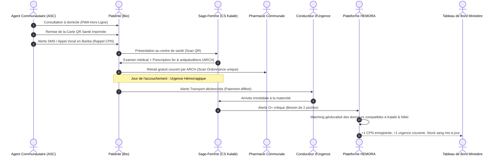

# 🩺 BENINVIE — Plateforme Nationale de Santé Numérique du Bénin
### *Intégrant le Système d'Information Hospitalier (SANTÉ+) et le Réseau d'Urgence Transfusionnelle (HEMORA)*

> **Gbɛ** (« *La Vie* » en langues béninoises) est la réponse technologique souveraine et intégrée aux orientations stratégiques du **Programme d'Action Wadagni - Talata 2026** : un **carnet de santé digital adossé à un SIH généralisé**, la **prise en charge systématique des urgences vitales par paiement différé**, la valorisation sécurisée de la **pharmacopée traditionnelle certifiée**, l'assistance diagnostique par **Intelligence Artificielle**, la couverture maladie universelle (**ARCH / GBESSOKE**) et la mobilisation d'urgence de sang (**HEMORA**).

      

---

## 🏛️ Alignement Stratégique : Programme d'Action Wadagni - Talata 2026

Le projet **Gbɛ (BENINVIE)** unifie les modules développés dans `sant-plus` et `BMM` pour répondre point par point aux priorités du programme présidentiel :

| Axe du Programme Wadagni - Talata 2026 | Engagement Officiel du Programme | Implémentation dans la Plateforme Gbɛ |
|---|---|---|
| **Santé — Carnet & SIH (p. 13)** | « Mise en place d'un carnet de santé digital (dossier patient électronique) pour chaque Béninois adossé à un Système d'Information Hospitalier (SIH) généralisé à toutes les structures sanitaires » | **Dossier Patient Numérique HL7 FHIR**, interconnexion CHIC Calavi, CHU Parakou, hôpitaux de zone et 600 CS réhabilités. Carte sanitaire IASO des 77 communes. |
| **Santé — Urgences Vitales (p. 13)** | « Prise en charge systématique des soins d'urgence vitale pour toute la population béninoise via un dispositif de paiement différé » | **Module Admission Bris de Glace & Paiement Différé** : prise en charge immédiate sans caution financière, authentification NPI, apurement différé garanti. |
| **Santé — Pharmacopée Innovante (pp. 12-13)** | « Structurer une filière nationale dédiée à la pharmacopée traditionnelle... Mécanisme d'accréditation des tradipraticiens limité à la prescription de médicaments traditionnels certifiés » | **Registre des Tradipraticiens Accrédités** et module d'ordonnances sécurisées pour remèdes traditionnels certifiés ARS / Agence Nationale du Médicament. |
| **Santé & Tech — Télémédecine & IA (pp. 13, 65)** | « Généralisation progressive de la télémédecine et utilisation de l'IA pour le diagnostic et la décision clinique » | **Module IA Triage Clinique & Aide à la Décision** (moteur Gemini multilingue vocal/texte), téléconsultation à faible bande passante. |
| **Santé — Soins Communautaires (p. 12)** | « Déploiement de plus de 16 000 agents de santé communautaire pour rapprocher les soins des populations » | **Application PWA Hors-Ligne pour les 16 000 ASC** : suivi prénatal, paludisme, malnutrition, synchronisation automatique dès retour réseau. |
| **Protection Sociale — ARCH & Filets Sociaux (pp. 14-15)** | « Généralisation de l'Assurance maladie ARCH, plateforme nationale de prestations sociales sur Registre des Ménages et NPI, transferts monétaires fléchés » | **Vérification automatique des droits ARCH**, interfaçage GUPS / RNM, transferts monétaires conditionnels fléchés (vaccins, CPN) via Mobile Money. |
| **Protection Sociale — SAMU Social (p. 15)** | « Mise en place d'un SAMU social national pour intervenir en urgence, orienter et accompagner les personnes en situation de grande précarité » | **Routage d'urgence médico-sociale** et dispatch de transport obstétrical communautaire (zémidjans, tricycles ambulanciers). |
| **Technologie — Souveraineté & Données (pp. 64-65)** | « Loi sur la localisation de la donnée, protection des données nationales, Super App IA gouvernementale et Relais digitaux communautaires » | **Conformité stricte APDP (Loi 2017-20)**, architecture prête pour les Data Centers nationaux béninois, interface adaptée aux Relais Digitaux (vocal Bariba, Fon, Yoruba, Dendi...). |
| **Urgences Transfusionnelles — HEMORA** | Réponse aux ruptures critiques de sang et aux hémorragies obstétricales | **Module HEMORA (BMM)** : matching d'urgence ABO/Rh, gestion prédictive des stocks de poches de sang, indemnisation forfaitaire de transport des donneurs. |

---

## 🛑 Règle n°1 : La démo ne doit jamais planter

Phase actuelle = **Démonstration & Validation Institutionnelle**. L'application tourne sur **Vercel** ou **Docker**, connectée à **PostgreSQL (Neon / Supabase)**, avec un jeu de **données déterministes hautement réalistes** contextualisées sur les 77 communes du Bénin (Kalalé, Parakou, Allada, Cotonou, Djougou, Tanguiéta...). Les connecteurs tiers (SMS, appels vocaux USSD/IVR, MTN MoMo, Moov Money, Bitcoin Lightning, OpenTimestamps) sont **simulés de manière transparente par défaut** tout en enregistrant fidèlement l'état en base de données.

---

## 🧭 Sommaire

1. [Architecture & Synergie des Dossiers (`BMM` + `sant-plus`)](#1-architecture--synergie-des-dossiers-bmm--sant-plus)
2. [Piliers Fonctionnels majeurs](#2-piliers-fonctionnels-majeurs)
   - [2.1 Carnet de Santé Digital & SIH Généralisé](#21-carnet-de-santé-digital--sih-généralisé)
   - [2.2 Prise en Charge d'Urgence Vitale & Paiement Différé](#22-prise-en-charge-durgence-vitale--paiement-différé)
   - [2.3 Filière Pharmacopée Traditionnelle & Accréditation](#23-filière-pharmacopée-traditionnelle--accréditation)
   - [2.4 IA Médicale, Triage Clinique & Télémédecine](#24-ia-médicale-triage-clinique--télémédecine)
   - [2.5 Module HEMORA : Urgences Transfusionnelles & Don de Sang](#25-module-hemora--urgences-transfusionnelles--don-de-sang)
   - [2.6 Protection Sociale : Couplage ARCH, GUPS & Transferts Fléchés](#26-protection-sociale--couplage-arch-gups--transferts-fléchés)
   - [2.7 PWA Hors-Ligne pour les 16 000 ASC & Relais Digitaux](#27-pwa-hors-ligne-pour-les-16-000-asc--relais-digitaux)
3. [Acteurs & Rôles](#3-acteurs--rôles)
4. [Scénario de Démonstration Officiel (Parcours « Bio » à Kalalé)](#4-scénario-de-démonstration-officiel-parcours--bio--à-kalalé)
5. [Sécurité, Souveraineté & Cadre Réglementaire (APDP & ARS)](#5-sécurité-souveraineté--cadre-réglementaire-apdp--ars)
6. [Intégrité Cryptographique & Preuve Blockchain](#6-intégrité-cryptographique--preuve-blockchain)
7. [Stack Technique Complète](#7-stack-technique-complète)
8. [Cartographie Sanitaire & Données Nationales IASO](#8-cartographie-sanitaire--données-nationales-iaso)
9. [Démarrage Rapide & Déploiement](#9-démarrage-rapide--déploiement)
10. [Variables d'Environnement](#10-variables-denvironnement)
11. [Feuille de Route d'Action Gouvernementale 2026](#11-feuille-de-route-daction-gouvernementale-2026)

---

## 1. Architecture & Synergie des Dossiers (`BMM` + `sant-plus`)

Le dépôt **BENINVIE** fédère deux sous-ensembles complémentaires pour constituer une plateforme sanitaire nationale unifiée :

```
┌────────────────────────────────────────────────────────────────────────────────────────┐
│                                   BENINVIE / Gbɛ                                       │
│          Plateforme Collaborative & Système d'Information Hospitalier National         │
└──────────────────────────────────────────┬─────────────────────────────────────────────┘
                                           │
         ┌─────────────────────────────────┴─────────────────────────────────┐
         ▼                                                                   ▼
┌─────────────────────────────────┐                 ┌─────────────────────────────────┐
│           sant-plus             │                 │               BMM               │
│    (Système de Soins & SIH)     │                 │        (Module HEMORA)          │
├─────────────────────────────────┤                 ├─────────────────────────────────┤
│ • Dossier Patient FHIR          │                 │ • Réseau de donneurs de sang    │
│ • Triage IA & Décision Clinique │                 │ • Matching urgent ABO / Rhésus  │
│ • Carte Sanitaire IASO (77 com) │                 │ • Gestion des stocks de poches  │
│ • Ordonnances numériques        │                 │ • Alertes SMS / Email géociblées│
│ • Portails Hôpital / Médecin    │                 │ • Ancrage Bitcoin OpenTimestamps│
│ • Consentement APDP / Loi Num.  │                 │ • Indemnités Mobile Money/Lightning│
│ • Paiements MoMo / Lightning    │                 │ • PWA hors-ligne cartes donneurs│
└─────────────────────────────────┘                 └─────────────────────────────────┘
```

1. **`sant-plus`** apporte la brique clinique complète :
   - Le moteur de **dossier médical partagé** structuré en ressources **HL7 FHIR** (`Patient`, `Encounter`, `Observation`, `MedicationRequest`).
   - L'écran d'**assistance médicale et de triage IA** (`AiTriageScreen.tsx`) avec analyse des symptômes et orientation clinique.
   - La base de données géolocalisée **IASO Santé Bénin** (`beninHealthData.ts`), répertoriant les formations sanitaires des 12 départements (du CHIC Calavi et CNHU Cotonou jusqu'aux centres de santé communaux).
   - Le portail d'accréditation des professionnels et la modale réglementaire de conformité **APDP** (`ApdpConsentModal.tsx`).

2. **`BMM` (HEMORA)** apporte la brique d'urgence transfusionnelle et de confiance cryptographique :
   - L'algorithme de **matching d'urgence transfusionnelle** combinant compatibilité hématologique ABO/Rhésus, distance géodésique de Haversine et assiduité.
   - Le moteur de **campagnes géociblées** de don de sang par SMS/Email.
   - La certification d'intégrité via **Bitcoin OpenTimestamps (OTS)** et vérification de clé **BIP-322**.
   - Le protocole de **défraiement forfaitaire de transport** non-dépositaire (Mobile Money / Lightning Network).

---

## 2. Piliers Fonctionnels majeurs

### 2.1 Carnet de Santé Digital & SIH Généralisé
*Répond au projet p. 13 : « Carnet de santé digital adossé à un SIH généralisé à toutes les structures ».*
- **Identifiant Unique NPI** : Relié au Registre National des Personnes Physiques (RNPP) et à l'ANIP.
- **Portabilité Nationale** : Un patient suivi au Centre de Santé d'Ina ou de Bembèrèkè retrouve l'intégralité de ses antécédents, allergies et groupe sanguin au CHU de Parakou ou au CHIC de Calavi.
- **Modèle de Données HL7 FHIR** : Assure l'interopérabilité internationale et l'intégration avec le SIH national et DHIS2.
- **Accès Multi-Supports** : Accessible par application web/mobile, par **carte QR physique imprimée** (pour les personnes sans smartphone), ou par **serveur vocal interactif (IVR)**.

### 2.2 Prise en Charge d'Urgence Vitale & Paiement Différé
*Répond au projet p. 13 : « Prise en charge systématique des soins d'urgence vitale via un dispositif de paiement différé ».*
- **Principe « Zéro Refus pour Défaut de Paiement »** : Aucune avance financière ou caution n'est exigée à l'arrivée d'un patient en détresse vitale (accident grave, détresse respiratoire, hémorragie de la délivrance).
- **Mode « Bris de Glace » Tracé** : L'urgentiste accède instantanément au profil vital (groupe sanguin, allergies, antécédents cardiovasculaires) en scannant la carte ou en saisissant le NPI. Tout accès d'urgence est journalisé de façon immuable.
- **Ouverture Automatique du Dossier de Paiement Différé** : Enregistrement de l'admission dans le registre national des urgences. La facturation est mise en attente et couplée aux dispositifs de garantie publique et au panier de soins d'urgence de l'État.
- **Apurement Sécurisé** : Recouvrement après stabilisation via les mécanismes d'assurance maladie (ARCH), de mutuelle ou de facilités de paiement échelonné Mobile Money.

### 2.3 Filière Pharmacopée Traditionnelle & Accréditation
*Répond au projet pp. 12-13 : « Structurer une filière nationale dédiée à la pharmacopée traditionnelle... Mécanisme d'accréditation des tradipraticiens limité à la prescription de médicaments traditionnels certifiés ».*
- **Registre National des Tradipraticiens Accrédités** : Espace dédié sous la supervision de l'Autorité de Régulation du secteur de la Santé (ARS) et du Ministère de la Santé.
- **Catalogue Officiel des Médicaments Traditionnels Améliorés (MTA)** : Seuls les remèdes certifiés et homologués par l'Agence Nationale du Médicament et de la Pharmacopée peuvent être prescrits numériquement.
- **Ordonnance Sécurisée Dédiée** : Génération d'ordonnances numériques dotées d'un QR code infalsifiable, assurant la traçabilité des prescriptions traditionnelles, la posologie standardisée et la prévention des interactions médicamenteuses avec les traitements conventionnels.

### 2.4 IA Médicale, Triage Clinique & Télémédecine
*Répond au projet pp. 13 & 65 : « Généralisation progressive de la télémédecine et utilisation de l'IA pour le diagnostic et la décision clinique ».*
- **Triage Pré-Clinique Assisté par IA (Gemini)** : Saisie vocale ou textuelle des symptômes en français et en langues locales. L'IA classe le niveau d'urgence (vert, jaune, orange, rouge) selon les arbres de décision cliniques validés au Bénin.
- **Aide à la Décision pour les Soignants et ASC** : Suggestions diagnostiques contextuelles (paludisme simple vs grave, déshydratation aiguë, pré-éclampsie, pneumonie infantile).
- **Réseau de Télé-Expertise** : Mise en relation audio/vidéo basse consommation entre les infirmiers de centres de santé ruraux et les spécialistes des hôpitaux départementaux et du CHIC.

### 2.5 Module HEMORA : Urgences Transfusionnelles & Don de Sang
*Hérité du projet `BMM` développé lors du Hackathon Bitcoin Mastermind 2026.*
- **Matching Transfusionnel Instantané** :
  $$\text{Score} = \text{Compatibilité Strict ABO/Rh} \times \left( \max(0, 100 - 5 \times \text{Distance}_{\text{km}}) + \text{Bonus Assiduité} \right)$$
- **Surveillance des Stocks Nationaux** : Remontée en temps réel des réserves de poches par groupe (O−, O+, A+, etc.) dans chaque banque de sang et hôpital de zone.
- **Campagnes d'Appel Ciblées** : Déclenchement automatique de notifications SMS / e-mails sur un rayon paramétrable dès qu'un seuil critique est franchi.
- **Indemnité Forfaitaire de Déplacement** : Rémunération du don strictement interdite (conformité OMS) ; en revanche, un **défraiement forfaitaire du transport** est alloué systématiquement à la présentation (même ajournée) via Mobile Money ou Lightning Network, éliminant tout frein financier au geste civique.

### 2.6 Protection Sociale : Couplage ARCH, GUPS & Transferts Fléchés
*Répond au projet pp. 14-15 : « Généralisation du volet Assurance maladie du projet ARCH, Registre National des Ménages, transferts monétaires fléchés ».*
- **Contrôle Instantané des Droits ARCH** : Dès la lecture du NPI, le système interroge le référentiel ARCH et applique le tiers-payant conventionné (prise en charge à 100% du panier de soins de base pour les populations ciblées).
- **Liaison avec les GUPS** : Signalement direct des ménages en grande précarité vers le Guichet Unique de Protection Sociale de la commune pour activation des filets **GBESSOKE**.
- **Transferts Monétaires Numériques Fléchés** : Une consultation prénatale (CPN) ou un cycle vaccinal validé sur la plateforme déclenche automatiquement un transfert financier d'incitation nutritionnelle au bénéfice du ménage via Mobile Money.
- **SAMU Social National** : Coordination d'urgence pour l'orientation et la prise en charge médicale des personnes sans abri, enfants vulnérables et urgences psychosociales.

### 2.7 PWA Hors-Ligne pour les 16 000 ASC & Relais Digitaux
*Répond au projet pp. 12 & 64 : « Plus de 16 000 agents de santé communautaire » et « Relais digitaux communautaires ».*
- **Fonctionnement 100% Hors-Ligne** : L'agent communautaire saisit les consultations à domicile, dépiste la malnutrition par mesure du périmètre brachial et enregistre les cas de fièvre dans les hameaux isolés.
- **Synchronisation Sécurisée** : Dès que l'appareil capte la 3G/4G au chef-lieu, les données sont chiffrées et envoyées au SIH central.
- **Médiation par les Relais Digitaux** : Accompagnement des populations non francophones ou analphabètes grâce à des synthèses vocales interactives en Bariba, Fon, Yoruba, Dendi, Goun et Adja.

---

## 3. Acteurs & Rôles

| Rôle | Périmètre d'Action dans Gbɛ |
|---|---|
| `patient` | Consultation de son carnet, prise de RDV, gestion des consentements, QR d'accès vital, mutuelle |
| `asc` (16 000 agents) | Enregistrement terrain hors-ligne, rappels vaccinaux, CPN, alertes nutritionnelles |
| `relais_digital` | Accompagnement citoyen de proximité, vulgarisation des usages numériques en langues locales |
| `soignant` (médecin, sage-femme, infirmier) | Consultation SIH, diagnostic IA, prescription signée, accès bris de glace, téléconsultation |
| `tradipraticien` | Prescription accréditée de médicaments traditionnels certifiés par l'autorité réglementaire |
| `pharmacie` | Validation de l'ordonnance à usage unique, délivrance, déclaration des stocks officiels |
| `banque_sang` (HEMORA) | Gestion des stocks de poches, lancement de campagnes, validation des dons et défraiements |
| `donneur` | Carte donneur certifiée, réponse aux alertes d'urgence vitale, portefeuille civique |
| `conducteur_urgence` | Mobilisation géolocalisée (zémidjan, tricycle-ambulance) pour le transport obstétrical |
| `assureur` (ARCH / Mutuelle) | Vérification instantanée d'éligibilité, prise en charge et liquidation des remboursements |
| `ministere` / `ars` | Supervision épidémiologique temps réel (DHIS2), audit qualité, accréditations nationales |

---

## 4. Scénario de Démonstration Officiel (Parcours « Bio » à Kalalé)

> **Persona** : Bio, 28 ans, enceinte de 7 mois, résidant dans un village de la commune de **Kalalé** (Département du Borgou), locutrice **Bariba**, sans smartphone personnel.



---

## 5. Sécurité, Souveraineté & Cadre Réglementaire (APDP & ARS)

Le traitement des données au sein de Gbɛ est conçu pour être un modèle d'application du droit béninois :

- **Loi n° 2017-20 portant Code du Numérique en République du Bénin** : Respect scrupuleux des dispositions relatives à la protection des données à caractère personnel sous le contrôle de l'**Autorité de Protection des Données Personnelles (APDP)**.
- **Consentement Éclairé & Révocation** : Le patient valide formellement les praticiens habilités à consulter son dossier. Il peut révoquer un accès à tout instant depuis son espace ou auprès d'un GUPS / relais digital.
- **Régulation de l'ARS** : Validation des qualifications professionnelles et respect des protocoles nationaux de soins édictés par l'Autorité de Régulation du secteur de la Santé.
- **Localisation des Données** : Architecture compatible avec l'hébergement au sein des **Data Centers Nationaux sécurisés du Bénin**, garantissant la souveraineté numérique sanitaire de l'État.

---

## 6. Intégrité Cryptographique & Preuve Blockchain

Le système distingue strictement la **donnée médicale confidentielle** de la **preuve d'intégrité publique** :

```
[ Base PostgreSQL Sécurisée ] ────> Empreinte SHA-256 ( Sel + Poivre + Données FHIR )
                                                   │
                                                   ▼
[ Journal d'Audit Immuable ]  ────> Racine de Merkle périodique
                                                   │
                                                   ▼
[ Bitcoin / OpenTimestamps ]  ────> Ancrage d'intégrité infalsifiable et horodaté
```

- **Usage Unique des Ordonnances** : Empêche formellement qu'une ordonnance délivrée à Parakou ne soit réutilisée dans une officine de Cotonou.
- **Cartes Donneur Immuables** : Certifiées par signature numérique Ed25519 vérifiable hors-ligne.
- **Effacement Conforme APDP** : En cas de demande légale d'effacement, la destruction du sel cryptographique hors-chaîne rend l'empreinte mathématiquement irréversible (effacement cryptographique garanti).

---

## 7. Stack Technique Complète

| Domaine | Technologies retenues |
|---|---|
| **Applications Web & Portails** | Next.js 16 (App Router), React 19, TypeScript strict, Vite |
| **Interface Utilisateur** | Tailwind CSS v4, shadcn/ui, Lucide Icons, Framer Motion |
| **Bases de Données & Stockage** | PostgreSQL 16 (+ PostGIS pour calculs géodésiques), Neon, Supabase |
| **ORM & Typage Schéma** | Drizzle ORM, Drizzle-Kit, Zod |
| **Intelligence Artificielle** | Google Gemini SDK (`@google/genai`), Triage clinique probabiliste |
| **Standard de Données Médicales**| HL7 FHIR (Patient, Encounter, Observation, MedicationRequest) |
| **Mode Hors-Ligne (ASC)** | Progressive Web App (PWA), Service Workers, IndexedDB |
| **Cartographie Sanitaire** | Leaflet, OpenStreetMap, données officielles IASO Bénin |
| **Ancrage & Identité Décentralisée**| JavaScript-OpenTimestamps, bip322-js, bitcoinjs-lib |
| **Canaux d'Inclusion Sans Smartphone**| Passerelle SMS, USSD interactif, appels vocaux IVR en langues locales |
| **Paiements & Micro-Transactions**| Intégrations MTN Mobile Money, Moov Money, Lightning Network (Breez Liquid SDK) |
| **Conteneurs & Déploiement** | Docker, Docker Compose, Vercel, Render |

---

## 8. Cartographie Sanitaire & Données Nationales IASO

La plateforme intègre nativement la cartographie des infrastructures sanitaires publiques et privées du Bénin (extraite du registre national IASO et modélisée dans `sant-plus/server/beninHealthData.ts`) :

- **Établissements de Référence Nationale** :
  - Centre Hospitalier International de Calavi (**CHIC** - pôle d'excellence)
  - Centre National Hospitalier Universitaire Hubert K. Maga (**CNHU-HKM**, Cotonou)
  - Centre Hospitalier Universitaire Mère-Enfant Lagune (**CHU-MEL**, Cotonou)
  - Futur Centre Hospitalier International Moderne de **Parakou**
- **Centres Hospitaliers Départementaux (CHD)** : Ouémé (Porto-Novo), Borgou (Parakou), Zou (Abomey), Mono-Couffo, Atacora (Natitingou).
- **Hôpitaux de Zone (HZ)** : Abomey-Calavi/Sô-Ava, Savè, Allada, Tchaourou, Tanguiéta, Kandi, Djougou, etc.
- **Centres de Santé d'Arrondissement et de Commune (CSA / CSC)** : Plus de 600 formations sanitaires locales interconnectées pour le maillage de premier niveau.

---

## 9. Démarrage Rapide & Déploiement

### Déploiement Simplifié avec Docker

```bash
# 1. Cloner le projet
git clone https://github.com/SAGBO4/BENINVIE.git
cd BENINVIE

# 2. Configurer l'environnement
cp .env.example .env

# 3. Lancer la stack complète (Postgres + PostGIS + SIH + Module HEMORA)
docker compose up --build
```
L'application unifiée est immédiatement accessible sur **http://localhost:3000**.

### Comptes de Démonstration Préconfigurés

Tous les comptes de démonstration utilisent le mot de passe : `demo2026`

- **Sage-Femme / Médecin** : `soignant@demo.bj`
- **Officine Pharmaceutique** : `pharmacie@demo.bj`
- **Agent Communautaire (ASC)** : `asc@demo.bj`
- **Hôpital de Référence (CHIC / CHD)** : `hopital@demo.bj`
- **Banque Nationale de Sang** : `banquesang@demo.bj`
- **Donneur Volontaire** : `donneur@demo.bj`
- **Patiente (Bio)** : `patient@demo.bj`
- **Supervision Ministère / ARS** : `ministere@demo.bj`
- **Administration Système** : `admin@demo.bj`

---

## 10. Variables d'Environnement

```ini
# Base de données PostgreSQL (Neon ou Supabase)
DATABASE_URL=postgres://dev:dev@db:5432/gbe
DATABASE_URL_UNPOOLED=postgres://dev:dev@db:5432/gbe
DB_DRIVER=pg # 'pg' en local/docker, 'neon' sur cloud serverless

# Sécurité & Chiffrement
AUTH_SECRET=cle_secrete_jwt_session_2026
HASH_PEPPER=grain_de_sel_national_apdp_2026
SIGNING_PRIVATE_KEY=cle_privee_ed25519_cartes_qr

# Intelligence Artificielle & Triage
GEMINI_API_KEY=votre_cle_google_genai

# Modes Démo & Connecteurs Tiers (Passerelles simulées par défaut)
DEMO_MODE=true
SMS_MODE=simulate      # simulate | live
IVR_MODE=simulate      # simulate | live
PAYMENT_MODE=simulate  # simulate | live (MTN / Moov)
LIGHTNING_MODE=simulate# simulate | live (Breez)
OTS_MODE=simulate      # simulate | live (OpenTimestamps)
```

---

## 11. Feuille de Route d'Action Gouvernementale 2026

- [x] **Phase 1 : Socle Unifié & Démonstrateur (T1 2026)**
  - Unification du carnet FHIR `sant-plus` et du moteur transfusionnel `BMM/HEMORA`.
  - Intégration de la carte sanitaire IASO des 77 communes.
  - Implémentation du paiement différé pour les urgences vitales.
- [ ] **Phase 2 : Phase Pilote Départementale (T2 2026)**
  - Expérimentation dans le département du Borgou (Parakou, Kalalé, Bembèrèkè) et de l'Atlantique (CHIC Calavi).
  - Déploiement auprès de 500 agents de santé communautaire en conditions réelles hors-ligne.
  - Connexion réelle aux API MTN Mobile Money et Moov Money pour les transferts fléchés.
- [ ] **Phase 3 : Généralisation Nationale & Certification ARS/APDP (T3-T4 2026)**
  - Homologation formelle du registre de pharmacopée traditionnelle.
  - Raccordement officiel aux data centers nationaux et au Registre National des Personnes Physiques (ANIP / NPI).
  - Généralisation de l'accès au carnet digital pour les 13 millions de citoyens béninois.

---

*Conçu avec fierté par les développeurs béninois pour la santé, la dignité et la souveraineté de la Nation.*
